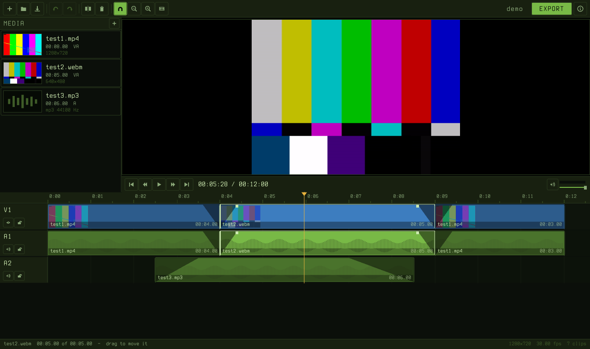

<p align="center">
  
</p>

# BENCsnip

[](https://github.com/bropple/BENCsnip/actions/workflows/ci.yml)
[](LICENSE)

A video editor for the jobs that should take a minute. Drag a file in, cut the
boring bit out, export. It opens whatever ffmpeg opens, which is nearly
everything, and it does not ask you to make an account first.



**[Download a build](https://github.com/bropple/BENCsnip/releases/latest)** —
an installer for Windows, a disk image for macOS, tarballs for Linux (x86-64
and ARM). Each one carries its own ffmpeg and needs nothing installed. Or
`make` it, which takes about twenty seconds.

It is roughly what Clipchamp is for, without the sign-in, the upload, the
watermark, the subscription tier that unlocks 1080p, or the four seconds of
splash screen. One executable, no installer, no runtime, no project cloud.

**One binary.** The font, the licences and the mascot are compiled into it —
there is no assets folder to lose. Link a static ffmpeg (see below) and the
result runs on a machine that has never heard of ffmpeg either.

---

## Quick start

```
make
./bencsnip
```

Then drag a video onto the window. Or start with one:

```
./bencsnip holiday.mp4
```

To cut a piece out of the middle: put the playhead where the boring bit starts,
press **S**, put it where the boring bit ends, press **S** again, click the
middle piece and press **Shift+Delete**. Then **Ctrl+E**.

---

## What it does

* **Anything in.** MP4, MOV, MKV, WebM, AVI, MPEG-TS, phone video, screen
  recordings, MP3, WAV, FLAC, Opus — if libav can demux it, it lands on the
  timeline. Portrait video from a phone comes in the right way up, because the
  display matrix is read rather than ignored.
* **A timeline that behaves.** Drag clips to move them, drag their edges to
  trim, drag the corner handles to fade. The pointer changes shape over
  anything draggable, so what a drag will do is visible before you commit to
  it. Snapping to cuts and to the playhead, which can be turned off. Video and
  its audio are linked and move together until you split them apart, or right-
  click and unlink them.
* **As many tracks as you want.** `+V` and `+A` above the track heads; move
  them up and down, hide, mute, lock or delete them. Every video track plays
  at once — **the top row is the back of the picture and the bottom row is in
  front**, which is upside down compared to most editors and is what this one
  was asked for.
* **A layout per video track.** Size, position, crop and mirrors, relative to
  the canvas, so a small video can play in the corner of a big one or two can sit
  side by side. There are presets for the layouts anyone actually wants. The
  canvas itself — size and frame rate — is a button in the toolbar, so a
  vertical or square project is two clicks. **?** in the toolbar lists every
  control there is.
* **Text on the picture.** Ctrl+T puts a caption at the playhead. Drag it
  about on the preview, drag a corner to resize it, and drag the handle above
  it to turn it — upright is sticky, and Shift steps by fifteen degrees. Fill
  and outline are both yours, and it will set in any font this machine has:
  868 turned up on the one it was written on, and there is a search box over
  the list. Colours are the hex code or your system's own picker. A caption is a clip on a track of its own, so it trims, slides,
  splits and layers like everything else, and it reorders among the
  video tracks by the same rule they do — move a text track to the top row and
  the caption goes behind the picture.
* **An effects lane under every track.** A thin strip that grows when you put
  something on it. Click anywhere on it to add a point and drag it; the curve
  between the points is what the track is put through. On a video or caption
  track that is how opaque the picture is — captions fade exactly the way
  pictures do, because it is the same number — and on an audio track it is the
  level. Right-click for the shapes worth having a name for: fade in, fade
  out, in and out, a square pulse, a sine wave. A point can be told to *hold*,
  which is what makes a square square. A preset goes over the stretch you
  marked with Shift and a drag, or the clips you selected, or the clip you
  right-clicked, or the whole track — whichever of those you actually did, and
  the menu says which.
* **Channels, when you want them.** A file's audio arrives as one clip
  however many channels it has — the bin says mono, stereo or how many — and
  right-clicking it offers to split them apart, one mono clip per channel,
  each on its own track. Nothing is downmixed on the way: each clip decodes
  the channel it is for.
* **A level per audio track.** A fader in the track head, on top of the level
  already on each clip, so turning a whole track of dialogue down is one
  gesture rather than one per clip.
* **A preview that stays in sync.** The picture is chosen to match how much
  sound the audio device has actually played, so a slow decode drops a frame
  rather than sliding the sound away from the picture.
* **A menu bar on macOS.** File and Edit where a Mac expects them, with the
  usual shortcuts. Windows and Linux keep the toolbar for now.
* **Export that is honest about what it is doing.** The dialog tells you
  whether it is going to re-encode the whole timeline or copy the packets
  across untouched — and it copies whenever it can. It also says how big the
  result will be: exactly, for a copy, and "about" for a render, because at
  constant quality the encoder decides the bitrate from the picture and
  nothing can know that in advance without doing the work.
* **Undo everything**, two hundred steps deep.

### The fast trim

Trimming one file and exporting it in the same format does not need to
re-encode anything. BENCsnip notices, copies the packets straight across, and a
four-gigabyte camera file is trimmed in about a second with no quality lost at
all. The export dialog says so before you commit:

```
fast trim: the file is copied, not re-encoded.
it starts at the keyframe before the in point.
```

That second line is the deal you are making. A copy can only begin at a
keyframe, so the result may include up to a GOP — usually under two seconds —
before the in point you set. When that matters, change any export setting (the
size, the frame rate, the format) and it renders instead, exactly.

Anything else — two files, a cut, a fade, a resize — renders. Rendering is
exactly what the preview showed you, because both go through the same code.

---

## Keys

| | |
|---|---|
| **Space** | play / pause |
| **S** | split every track at the playhead |
| **Delete** or **Backspace** | delete the selected clip — Backspace matters on a Mac, where the key is labelled delete |
| **Shift+Delete** | delete it and close the gap |
| **M** | mute the selected clip |
| **← →** | one frame; hold Shift for a second |
| **, .** | to the previous / next cut |
| **Home / End** | to the beginning / the end |
| **F** | fit the whole timeline in the window |
| **R** | turn the selected caption 15°; Shift+R the other way |
| **C** | size, position and crop for the selected picture |
| **Tab** | the next layer under the pointer, when several overlap |
| **+ −** | zoom in / out |
| **Ctrl+Z / Ctrl+Shift+Z** | undo / redo |
| **Ctrl+I** | add media to the bin |
| **Ctrl+S / Ctrl+Shift+S** | save the project / save it somewhere else |
| **Ctrl+O** | open a project |
| **Ctrl+E** | export |
| **Ctrl+N** | start again |
| **Ctrl+A** | select everything |
| **Ctrl+T** | put a caption at the playhead |
| **Esc** | select nothing |
| **F12** | write a screenshot beside the program |

The mouse: click a clip to select it, drag the middle to move it, drag either
edge to trim it, drag the small square in a top corner to make a fade, and
drag the line across an audio clip to change its level — it snaps back to 0 dB
on the way past. Fades live on the effects lane under each track: click to add
a point, drag it about, and right-click for presets or to delete one. Only the
ruler moves the playhead. The pointer's shape says which of those you are about to do.
The ruler scrubs, and it is the only thing that moves the playhead. The wheel
scrolls the tracks, Shift with it scrolls sideways, Ctrl zooms, and a sideways
swipe on a trackpad scrolls sideways; the middle button pans. There are
scrollbars for both. Right-click a clip for the rest. Delete with
nothing selected closes the gap the playhead is sitting in. Double-click the
project's name in the toolbar to change it — the export is named after it.

On the preview: drag a video layer about, or its handles to resize it, and
double-click it for the numbers. A caption works the same way and has a handle
above it for turning — Shift steps that by fifteen degrees — and double-clicking
one opens the window with the words in it.

---

## Building

A GNU makefile, a C++17 compiler, raylib and the ffmpeg libraries. No CMake
step, no package manager, no code generation beyond turning the font into a C
array.

The one thing that is neither installed nor linked is `vendor/stb/stb_truetype.h`,
which is committed here: a single public-domain header, byte for byte the copy
raylib carries, used by `src/core` to turn text overlays into pixels. It is in
the core rather than the interface because the exporter has to draw the same
captions the preview does, and `src/core` has no raylib to ask.

### Linux

```
sudo pacman -S base-devel ffmpeg raylib        # Arch
sudo apt install build-essential libavformat-dev libavcodec-dev \
                 libswscale-dev libswresample-dev libraylib-dev   # Debian/Ubuntu

make
```

If your distribution has no raylib package, drop a prefix in `vendor/raylib`
with `include/` and `lib/libraylib.a` in it, or pass `RAYLIB=/somewhere`. The
build prefers a static `libraylib.a` where it finds one, so the result runs on
a machine that has never heard of raylib.

**Building raylib yourself, for Windows:** run `tools/no-gamepads.sh` against
the raylib source before you build it, as every workflow here does. GLFW looks
for game controllers while the window is being created, and on a machine with
a lot of things plugged into it that took ten and a half seconds — measured,
and it is why the released builds do not do it. Nothing here reads a joystick.
The same wait shows up in Windows' own Game Controllers panel (`joy.cpl`) on an
affected machine, which is the quickest way to tell it apart from anything this
program is doing.

### macOS

```
brew install ffmpeg raylib
make
```

### Windows

MSYS2, in the MINGW64 shell:

```
pacman -S mingw-w64-x86_64-gcc mingw-w64-x86_64-ffmpeg mingw-w64-x86_64-raylib
make
```

The Windows link is `-static`, and it stays in force to the end of the link
line: without that the executable imports `libstdc++-6.dll`,
`libgcc_s_seh-1.dll` and `libwinpthread-1.dll`, which live inside an MSYS2
installation and nowhere else — it runs on the machine that built it and fails
to start everywhere else, with a dialog naming a file the person has never
heard of. Against MSYS2's packaged ffmpeg, ffmpeg itself is the one thing left
dynamic, and its DLLs travel in the archive; against a static prefix nothing
does, and the archive is one file.

### A self-contained binary

By default the ffmpeg libraries are linked as shared objects, which is the
right choice for a distribution package: the user owns those libraries and can
replace them, which is also what the LGPL asks for. For a binary you hand to
someone directly:

```
tools/build-ffmpeg.sh          # ten to thirty minutes, into vendor/ffmpeg
make clean && make
make info                      # what the build decided, and from where
```

`make` prefers `vendor/ffmpeg` over the system libraries when it is there, and
`FFMPEG=/some/prefix` points it anywhere else. What comes out needs nothing but
OpenGL, X11 and libc:

```
$ ldd bencsnip | wc -l
14                             # and not one of them is libav
```

The script defaults to a GPL build with libx264, because H.264 is the format
that plays everywhere; `--lgpl` skips it and the export falls back. Read the
comment at the top of the script and NOTICE before you distribute either.

Neither ffmpeg nor x264 can be built under a path containing a space — the
script says so and tells you what to do instead, rather than installing half
of itself into the first word of your home directory.

### Other targets

```
make test        the core tests: the timeline, the decoder, the mixer, both
                 export paths. No window and no sound card needed.
make testmedia   writes three small test files into media/ with ffmpeg
make probe       a command-line media probe, for when it is unclear whether a
                 problem is the decoder or the interface
make icons       regenerates assets/icon from film_camera_star.svg
make clean
```

### Packaging

What the release workflow runs, and what to run by hand to see what a release
would contain:

```
tools/package.sh linux-x86_64 v0.1.1     an archive, stripped, with the
                                         licences and the ffmpeg configure line
tools/macos-app.sh bencsnip BENCsnip.app a bundle, ad-hoc signed   (macOS)
tools/macos-dmg.sh BENCsnip.app out.dmg  a drag-to-Applications image (macOS)
makensis -DSRCDIR=stage -DVERSION=v0.1.1 tools/windows-installer.nsi
```

The two art generators - `tools/make-dmg-background.sh` and
`tools/make-installer-art.sh` - write into `assets/brand`, and their output is
committed rather than built at release time. Art that regenerates on every
release is art that can silently change, and a release job should not need
ImageMagick to produce a picture nobody is going to look at until it is
wrong.

---

## Project files

A `.bencsnip` is lines of text, and it holds no media — a clip is a path, an in
point and an out point. Paths inside the project's own folder are stored
relative to it, so the folder can be moved or copied to another machine and
still open.

```
bencsnip 1
name holiday
video 1920 1080 30.000000
item 3 128.400000 1 1 clips/MVI_0043.MP4
track 5 0 0 0 0 V1
clip 8 3 9 12.000000 46.500000 0.000000 1.0000 0.0000 0.5000 0
```

It is a text file on purpose. The one time you need to look at a project file
is when something has gone wrong — a moved drive, a renamed folder — and a file
you can open in an editor and fix is worth more than one you cannot. A file
that has gone missing is kept in the bin, marked, with the duration the project
remembered; the edit survives and relinking one path brings it back.

---

## How it is put together

```
src/core/     sn_media       libav: probe, decode, seek, resample
              sn_timeline    tracks, clips, and every edit
              sn_render      the timeline as pictures and sound
              sn_project     save and load
              sn_export      the fast path and the rendering path

src/gui/      sn_gui         theme and widgets, drawn not toolkitted
              sn_player      the decode thread and the audio clock
              sn_bin         the media pane, and its thumbnail worker
              sn_track       the timeline pane
              sn_dialog      export, information, the file browser
              main.cpp       layout, keyboard, and the glue
```

`src/core` does not include raylib and never opens a window. That is what makes
`make test` possible on a machine with no screen and no sound card, and it is
much cheaper to hold to from the start than to retrofit.

Two decisions do most of the work:

**One renderer, two callers.** The preview and the exporter both ask
`sn::Renderer` the same question — what does the timeline look and sound like
at time *t* — so what you watched is what gets written. The usual way that goes
wrong is two pieces of code that both know how fades work.

**The audio device is the clock.** The worker thread mixes ahead into a ring
buffer; the device drains it; how much it has drained is the playback position,
and the picture is chosen to match. A preview driven by the wall clock or by
frames drawn slides out of sync with its own sound, slowly, in a way that is
maddening to diagnose.

See [ARCHITECTURE.md](ARCHITECTURE.md) for the rest.

---

## S. Tarr

BENCO's audio/visual person, and the reason he turns up here rather than
R. Triy. Inside the program he is drawn from the roster geometry rather than
loaded from a file, which is why he is never missing and never blurry at any
size the window happens to be.

The program's *icon* is separate artwork — S. Tarr in front of an old film
camera, `assets/icon/film_camera_star.svg` — because a five-pointed star on its
own does not say video editor. Every size comes out of that one file
(`make icons`): the window and taskbar icons compiled into the binary, the
`.ico` in the Windows executable and its installer, and the `.icns` in the
macOS bundle. Below 32 pixels the film strip is dropped and the camera scaled
up to fill the tile, because at 16 pixels a strip is four grey smudges and the
camera is the thing that has to read.

---

## Licence

MIT — see [LICENSE](LICENSE).

BENCsnip links FFmpeg (LGPL v2.1+, and GPL when built with `--enable-gpl`
components such as libx264) and raylib (zlib/libpng), vendors stb_truetype
(public domain / MIT), and embeds Terminus (TTF) under the SIL Open Font
License. [NOTICE](NOTICE) has the full attribution and
what it obliges you to do when you redistribute a binary; the information
window in the program shows the same text, which is how a binary-only copy
satisfies the OFL.
